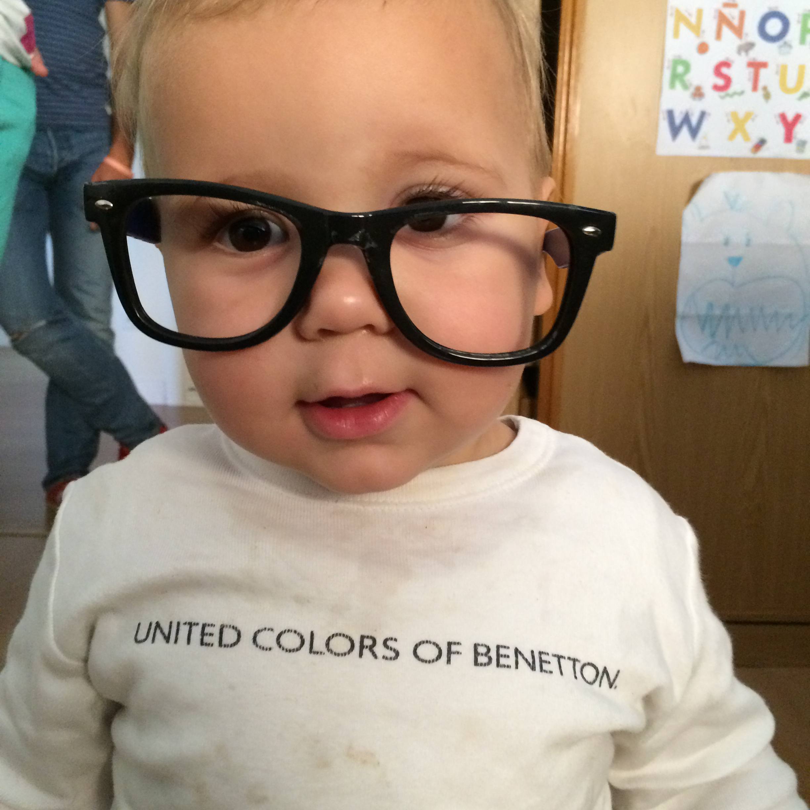

# CameraGameBoy
A python script to convert any picture in a “GameBoy” camera photo.
Author: Francisco Gárate
Licence: GPLv3
A quickly python script to convert any picture in a “GameBoy” camera photo.
It has been done in barely 15 minutes, and gotten better in other 10 minutes, so it’s easily to be improved (mainly to skip the temporal file  step).

**Example**
<pre>
python cameragb.py IMG_4934.jpg
</pre>

Input:
 {width: 200px;}

Output:

Todo:
- Skip the temp.JPG step
- Choose among different sizes
